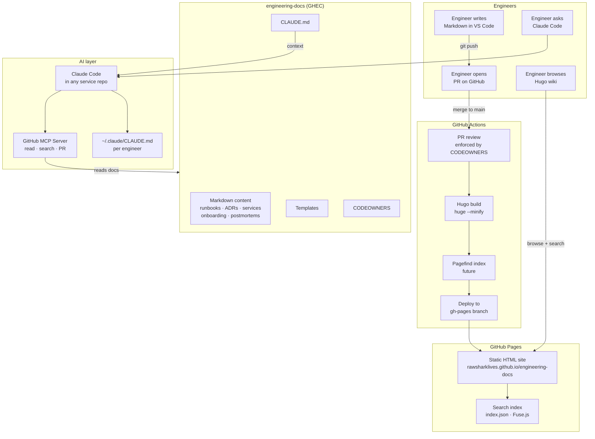

**Status:** Proposed
**Date:** April 2026
**Author:** Rich — VP Engineering
**Reviewers:** Platform Engineering Team

---

## Context

Our current engineering knowledge is fragmented and unreliable. Documentation is spread
across the DevOps Wiki, individual Coda pages, and informal Microsoft Teams threads —
with no single source of truth. Content is frequently stale, inconsistently formatted, and
hard to discover. Engineers waste time searching multiple systems for runbooks, architecture
decisions, and onboarding guides, and cannot trust that what they find is current.

There is no enforced structure around critical operational knowledge. Runbooks exist in
different formats across multiple systems. Architecture decisions are written down but live
in Microsoft Loop, which is disconnected from our engineering workflows and not easily
searchable by humans or AI tooling. Service-level knowledge — architecture, dependencies,
operational runbooks — is scattered across service repositories, wikis, and individuals,
with no consistent structure or single place to query. New joiners in particular struggle,
as onboarding material is scattered and out of date.

The current state also means Claude Code — and AI tooling more broadly — has no reliable
knowledge base to reference. Without a canonical, machine-readable docs store, AI-assisted
workflows have nothing authoritative to draw from. An AI asked about a service, an ADR, or
an operational procedure must either guess or ask the engineer — it cannot look it up.

## Decision

We will establish a docs-as-code platform built on four integrated components:

**1. Canonical Docs Repository (GHEC)**
A dedicated GitHub repository (`netwealth/engineering-docs`) in GitHub Enterprise Cloud
becomes the single source of truth for all engineering knowledge. All documentation is
written in Markdown and lives under version control. The repository is structured around
five content areas: runbooks, architecture decision records (ADRs), onboarding guides,
postmortems, and service documentation. Templates are provided for each type and enforced
via CODEOWNERS and PR review.

Service documentation — including architecture overviews, dependency maps, owner
information, SLOs, and service-specific runbooks — lives in `content/services/<service>/`
within this repository, not in individual service repositories. This ensures all service
knowledge is co-located, searchable, and accessible to both humans and AI in one place.

Service repositories retain only lightweight, locally-relevant documentation in their
`CLAUDE.md`: how to run the service locally, how to run tests, and build commands.
Everything substantive about a service belongs in engineering-docs.

**2. Static Site Wiki (Hugo + GitHub Pages)**
A Hugo-based static site renders the Markdown repository as a browsable internal wiki,
deployed automatically to GitHub Pages via GitHub Actions on every merge to `main`. This
gives the team a clean, searchable, human-readable interface to the docs without requiring
Git knowledge to read them. Service pages, ADRs, runbooks, and onboarding guides are all
discoverable from a single site.

**3. CLAUDE.md Instruction Layer**
A standard `~/.claude/CLAUDE.md` is distributed to each engineer via the onboarding
process and dotfiles, establishing context about the docs platform — where docs live, what
document types exist, which templates to use, and how to interact with the canonical store.
This applies globally across all repos without requiring per-repo configuration.

Service repositories contain a minimal `CLAUDE.md` covering only local setup and test
commands, with a pointer to their service page in engineering-docs for all other context.

**4. MCP Integration (GitHub MCP Server)**
Anthropic's GitHub MCP server is configured to give Claude Code programmatic access to
`engineering-docs`. This enables Claude to search, read, and propose changes to
documentation directly from within any engineering workflow — finding existing runbooks
before generating new ones, reading ADRs for architectural context, reading service
documentation when working within a service repo, and raising PRs when new documentation
is needed. Because all service knowledge lives in engineering-docs, a single MCP
configuration gives Claude access to the full picture.

**Repository structure:**

```
engineering-docs/
├── CLAUDE.md
├── content/
│   ├── runbooks/
│   ├── adr/
│   ├── onboarding/
│   ├── postmortems/
│   ├── standards/
│   └── services/
│       ├── <service-name>/
│       │   ├── _index.md        ← overview, architecture, owners, SLOs
│       │   ├── runbook-*.md     ← service-specific runbooks
│       │   └── adr-*.md         ← service-scoped decisions (if applicable)
│       └── ...
├── templates/
│   ├── runbook-template.md
│   ├── adr-template.md
│   ├── postmortem-template.md
│   └── service-template.md
├── hugo.toml
└── .github/
    └── workflows/
        └── deploy.yml
```

## Platform overview



## Consequences

### Positive

- **Single source of truth.** All engineering documentation — including service knowledge
  previously scattered across repos, Loop, and Coda — lives in one place, under version
  control, with a clear structure and enforced templates.
- **Documentation as a first-class engineering practice.** Docs go through the same
  review process as software — PRs, CODEOWNERS approval, and a clear audit trail.
- **Improved discoverability.** The Hugo wiki gives the whole team a fast, searchable,
  always-current interface to operational knowledge, services, and decisions in one place.
- **AI-ready knowledge base.** The MCP integration means Claude Code can answer questions
  about any service, find runbooks, and read ADRs from a single configured source — in any
  engineering workflow, without the engineer needing to provide context manually.
- **Low operational overhead.** No new infrastructure. GitHub Enterprise Cloud, GitHub
  Actions, and GitHub Pages are tools we already have.
- **Portability and longevity.** Plain Markdown in Git is readable by any tool, any
  editor, and any future platform.

### Negative

- **Adoption requires discipline.** The value is entirely dependent on consistent use.
  Without team buy-in, the repo risks becoming another stale documentation graveyard. This
  is a process change, not just a tooling change.
- **Service docs must be kept in sync with service repos.** Engineers making significant
  changes to a service are responsible for updating the corresponding service page in
  engineering-docs. This needs to be part of the definition of done.
- **Git as the contribution interface.** Non-engineering stakeholders will need guidance
  or a lightweight editor workflow.
- **Initial migration effort.** Existing useful content in the DevOps Wiki, Microsoft Loop,
  and Coda needs to be reviewed, updated, and migrated. This is a one-time cost but
  requires dedicated time to do properly.
- **MCP is relatively new tooling.** The GitHub MCP server integration requires
  familiarity and per-engineer configuration overhead.
- **Hugo theme maintenance.** Significant customisation would become an asset to maintain.
  Keeping it minimal reduces this risk.

### Follow-on work

- Configure GitHub MCP server for each engineer's Claude Code environment
- Distribute standard `~/.claude/CLAUDE.md` via onboarding and dotfiles
- Migrate high-value content from DevOps Wiki, Microsoft Loop, and Coda
- Add service pages for each existing service as part of the migration
- Add a service `_index.md` template to the templates directory
- Define a process for keeping service docs current (ownership, review cadence)
- Update each service repo's `CLAUDE.md` to be lightweight and point to engineering-docs
- Evaluate onboarding editor tooling for non-Git contributors

---

## Scaling and future-proofing

### Search at scale

The initial implementation uses PaperMod's built-in search, which is powered by
[Fuse.js](https://www.fusejs.io/) — a client-side fuzzy search library. On build, Hugo
generates an `index.json` at the site root containing the title, summary, tags, and
content of every page. The browser downloads this file in full and searches it in-memory.

This works well at low page counts but has two limitations as the docs store grows:

- **Index size.** At several hundred dense pages, `index.json` can reach 5–20MB. Every
  engineer visiting the search page downloads the entire index before the first result
  appears.
- **Search speed.** Fuse.js searches the full in-memory index on every keystroke. At
  thousands of pages this becomes perceptibly slow.

### Recommended next step: Pagefind

[Pagefind](https://pagefind.app/) is a static search library designed specifically for
sites of this kind. Rather than generating a single large index, Pagefind runs a
post-build indexing step that produces a set of small, chunked binary index files. The
browser only downloads the chunks relevant to the current query — typically a few
kilobytes — regardless of how large the total docs store is.

**Why Pagefind is the right next step:**

- Scales to tens of thousands of pages with no perceptible degradation
- Entirely static — no external service, no API key, no ongoing cost
- Works within the existing Hugo + GitHub Actions + GitHub Pages stack
- Integration requires adding a single post-build step to `deploy.yml` and a search page
  template; no changes to content or the Hugo theme
- Full-text search across all content, not just titles and summaries

**Integration approach:**

Add a Pagefind indexing step to `.github/workflows/deploy.yml` after the Hugo build:

```yaml
- name: Index with Pagefind
  run: npx pagefind --site public
```

Pagefind writes its index into `public/pagefind/`, which is then deployed to Pages
alongside the rest of the site. A minimal search UI is served from the same directory.

**Migration path:**

Pagefind can replace or complement the existing Fuse.js search. The simplest approach
is to replace the PaperMod search page with a Pagefind UI once the proof of concept
validates the quality and performance of results.

**When to migrate:**

The Fuse.js approach is adequate while the docs store is small. The trigger for switching
should be either of:

- `index.json` exceeds ~2MB (check at `https://<pages-url>/index.json`)
- Engineers report slow or degraded search experience

A proof of concept with realistic dummy data is planned to validate Pagefind's result
quality and confirm the integration approach before committing to the migration.
